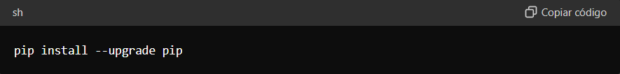

# ¿QUÉ ES EL PIP?

Pip es el administrador de paquetes de Python, utilizado para instalar y gestionar bibliotecas y dependencias en proyectos de Python. Su nombre es un acrónimo recursivo que significa "Pip Installs Packages" (Pip instala paquetes). A continuación, se detallan sus funciones y la razón por la cual es importante mantenerlo actualizado:

### Funciones de Pip:
1- Instalación de Paquetes: Permite instalar bibliotecas de Python desde el índice oficial de paquetes de Python (PyPI) o desde otras fuentes.

2- Gestión de Dependencias: Resuelve y instala automáticamente las dependencias necesarias para los paquetes.

3- Actualización de Paquetes: Facilita la actualización de paquetes instalados a sus versiones más recientes.

4- Desinstalación de Paquetes: Permite desinstalar paquetes que ya no son necesarios.

5- Listado de Paquetes Instalados: Proporciona una lista de todos los paquetes instalados en el entorno.

### ¿Por Qué Actualizar Pip?
1- Nuevas Características: Las actualizaciones de pip pueden incluir nuevas características que mejoran la funcionalidad y la usabilidad del administrador de paquetes.

2- Corrección de Errores: Las nuevas versiones a menudo corrigen errores y problemas que existían en versiones anteriores, mejorando la estabilidad y el rendimiento.

3- Mejoras en Seguridad: Las actualizaciones pueden incluir parches de seguridad para vulnerabilidades conocidas, protegiendo tu entorno de desarrollo contra posibles ataques.

4- Compatibilidad: Mantener pip actualizado asegura que sea compatible con las versiones más recientes de Python y con otros paquetes que dependan de él.

5- Rendimiento Mejorado: Las optimizaciones en el código de pip pueden resultar en tiempos de instalación más rápidos y en una mejor gestión de las dependencias.

### Cómo Actualizar Pip
Para actualizar pip a la última versión, se puede usar el siguiente comando en la terminal o en el prompt de comandos de Python:

Este comando descarga e instala la versión más reciente de pip disponible en PyPI.

### Conclusión
Pip es una herramienta esencial para cualquier desarrollador de Python, ya que simplifica la instalación y gestión de bibliotecas y dependencias. Mantener pip actualizado es crucial para asegurar que tu entorno de desarrollo sea seguro, eficiente y compatible con las últimas tecnologías y mejoras en Python.